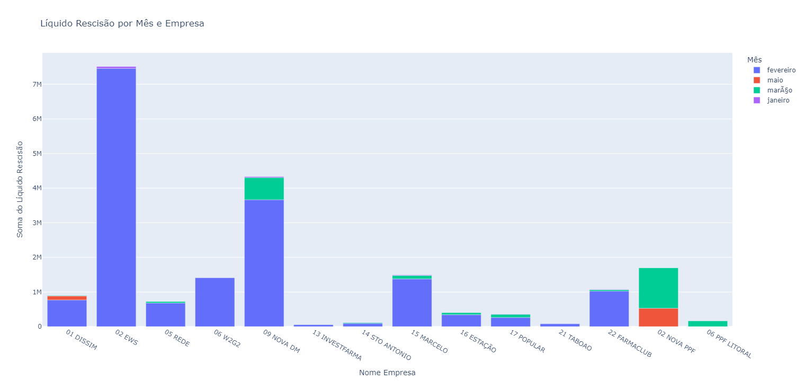
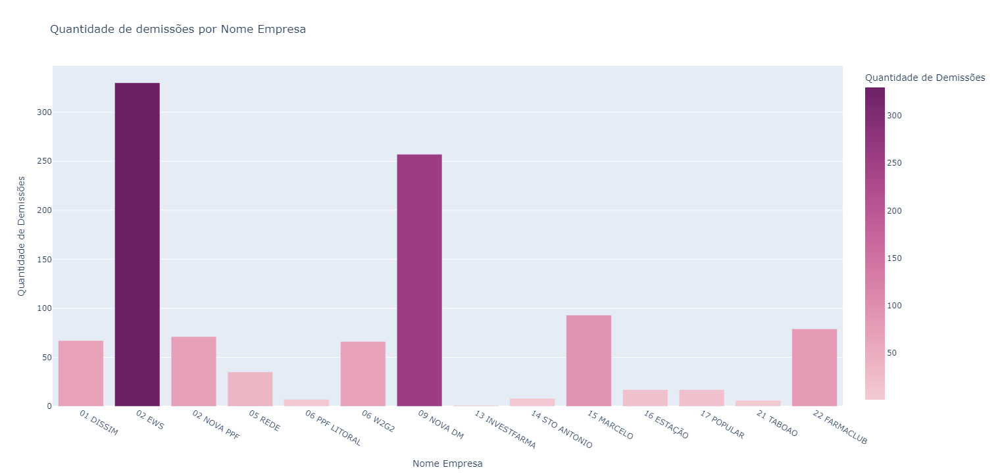
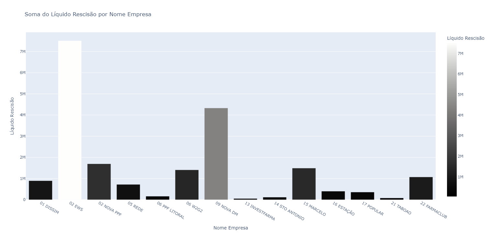

# Instalar o Python 3

Para baixar e instalar o Python 3, acesse o link abaixo:
[Instalar Python 3](https://www.python.org/downloads/)


# Instalar as dependencias abaixo

```bash
pip install plotly
pip install openpyxl
pip install pandas
python.exe -m pip install --upgrade pip
```


# Gráficos:

Líquido por Mês e Empresa
- 


Quantidade de demissões por Empresa
- 


Soma do Líquido Rescisão por Empresa
- 
